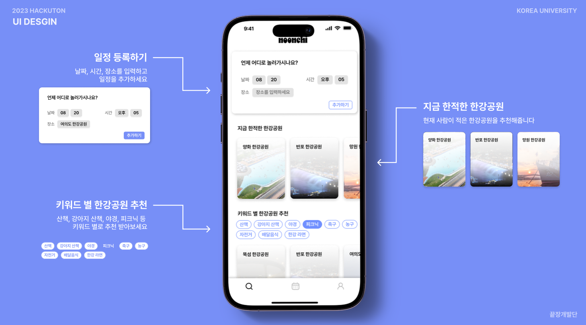
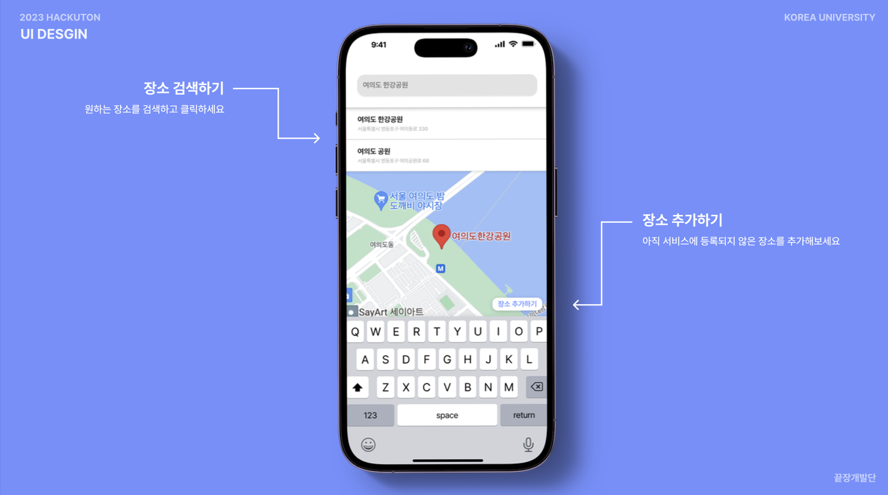
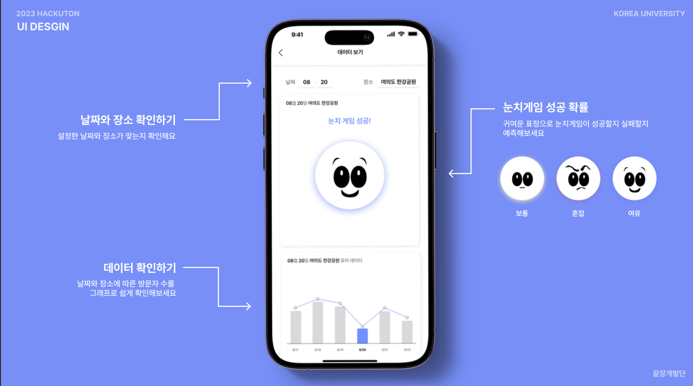
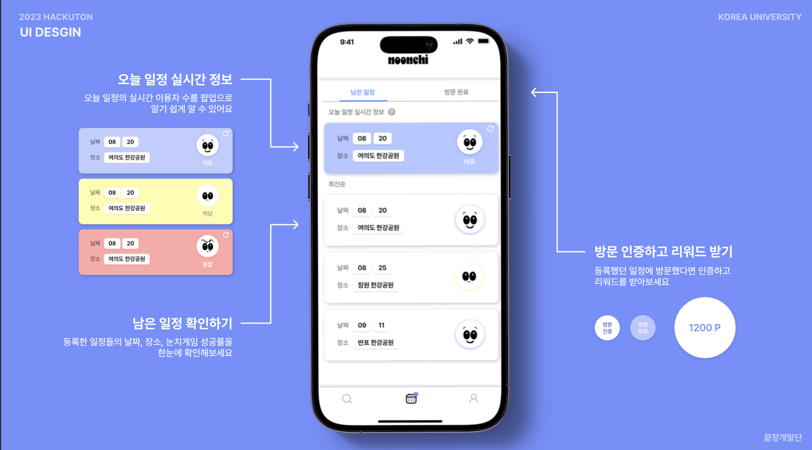

# 2023 고려대학교 해커톤 KU_hackuton 2등 수상작 "눈치"

인파가 몰릴 것으로 예상된 곳에 갔는데 사람이 생각보다 없다면?
이것이 소확행 아닐까

앱의 기능은 다음과 같다.
---

### 홈화면

자신의 일정을 입력할 수 있는 화면이다.

클릭 시 다음 화면으로 넘어가, 원하는 장소를 입력할 수 있다.

검색을 완료하면 날짜 및 장소가 두 번째 탭의 일정 관리에 저장된다.

장소 선택 시 다음 화면으로 이동하여 눈치 게임 결과를 보여준다.

눈치 게임 성공 확률은 앱 유저의 검색 결과를 기반으로 한다.

아래 제공되는 그래프는 두 가지로 

첫번째 그래프는 앱유저의 검색 결과이며 두 번째는 기존에 공개된 한강 공원 이용객 데이터이다.

### 일정탭

첫 번째 탭에서 저장한 일정은 두번 째 탭에 저장된다.

남은 일정 화면과 방문 완료 화면이 있다.

오늘 일정은 실시간 정보로 제공 되며

등록한 일정들의 날짜, 장소, 눈치게임 성공률을 확인 할 수 있다.

방문 완료한 일정은 방문 인증을 할 수 있다.(GPS 기반으로 하고자 하였으나 미구현 상태)

### 마이페이지

인증완료 시에 제공되는 리워드를 확인 할 수 있다.

### 개발자

프론트엔드:고려대학교 컴퓨터학과 노태윤

백엔드:고려대학교 스마트보안학부 김태영
